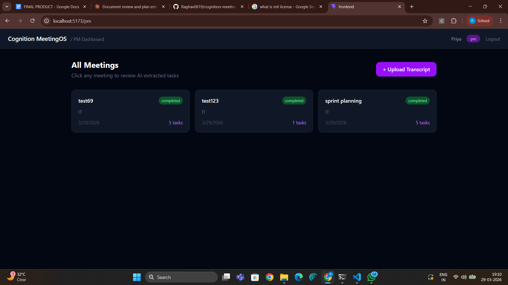
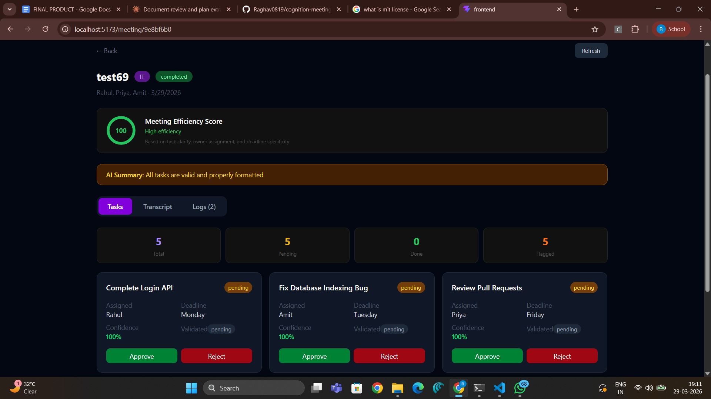
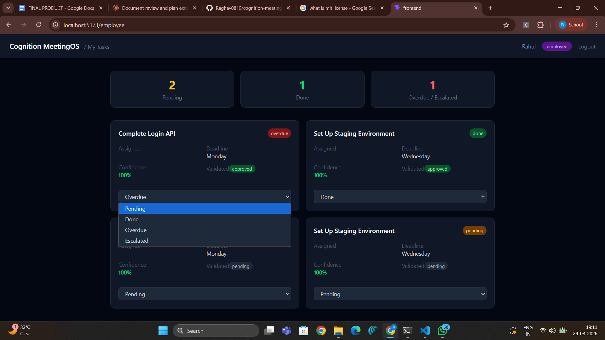
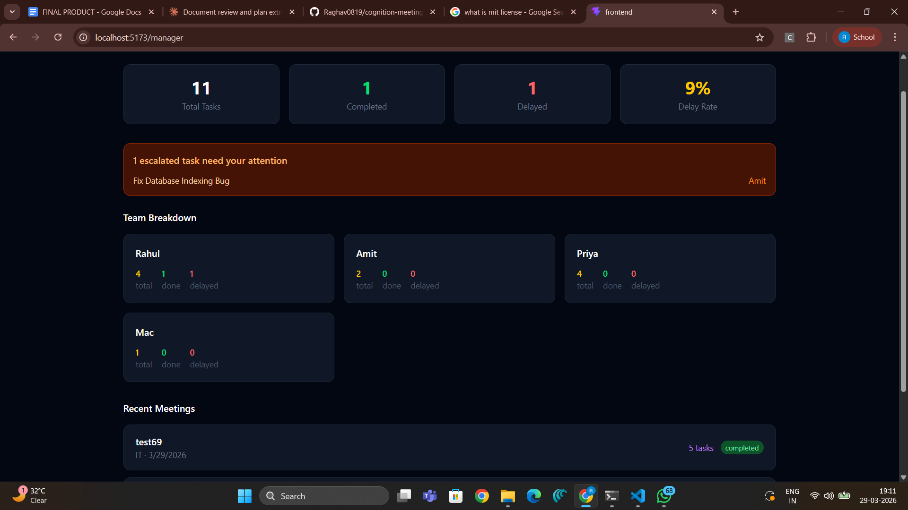
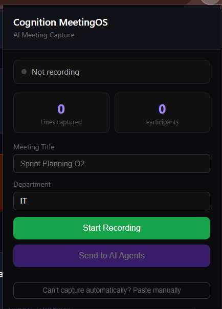

# Cognition MeetingOS

> "We built an AI system that turns meetings into accountable execution — automatically."

## What it does

Cognition MeetingOS captures Google Meet transcripts and converts them into:
- Tasks with owners and deadlines
- Decisions and risks
- Execution workflows with follow-up and escalation
- Full audit trail of every AI action

## Architecture
```
Google Meet → Chrome Extension → FastAPI Backend → CrewAI Multi-Agent System → React Dashboard
```

## Multi-Agent System (CrewAI + Groq)

| Agent | Role |
|---|---|
| Extraction Agent | Extracts tasks, decisions, risks from transcript |
| Assignment Agent | Assigns each task to the right person |
| Confidence Agent | Scores each task 0-100 |
| Validation Agent | Flags low confidence tasks for PM review |
| Follow-up Agent | Creates follow-up schedule and escalation paths |
| Audit Agent | Saves everything to DB and logs all actions |

## Tech Stack

- **Backend**: Python, FastAPI, SQLAlchemy, SQLite
- **AI**: CrewAI, Groq (llama-3.3-70b-versatile)
- **Frontend**: React, Vite, Tailwind CSS
- **Extension**: Chrome Extension (Manifest V3)

## Role-Based Dashboards

- **PM Dashboard** — all meetings, task validation, agent logs
- **Employee Dashboard** — my tasks, status updates
- **Manager Dashboard** — team overview, delays, escalations

## Setup

### Backend
```bash
cd backend
python -m venv venv
venv\Scripts\activate
pip install fastapi uvicorn sqlalchemy python-dotenv crewai crewai-tools litellm groq
```

Create `backend/.env`:
```
OPENAI_API_KEY=your_key
GROQ_API_KEY=your_groq_key
DATABASE_URL=sqlite:///./meetingos.db
APP_NAME=Cognition MeetingOS
```
```bash
uvicorn main:app --reload
```

### Frontend
```bash
cd frontend
npm install
npm run dev
```

### Chrome Extension
1. Open `chrome://extensions/`
2. Enable Developer Mode
3. Click Load Unpacked
4. Select the `extension/` folder

## Screenshots

### PM Dashboard


### Meeting Detail — Agent Logs


### Employee Dashboard


### Manager Dashboard


### Chrome Extension


